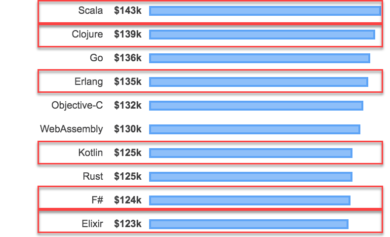

<style>
.reveal section img { background:none; border:none; box-shadow:none; }
</style>

## A Map to Success
### Functional Programming for Database Developers

<a href="https://www.catallaxyservices.com">Kevin Feasel</a> (<a href="https://twitter.com/feaselkl">@feaselkl</a>)<br />
<a href="https://csmore.info/on/fp">https://CSmore.info/on/fp</a>

---

@title[Who Am I?]

@div[left-60]
<table>
	<tr>
		<td><a href="https://csmore.info"></a></td>
		<td><a href="https://csmore.info">Catallaxy Services</a></td>
	</tr>
	<tr>
		<td><a href="https://curatedsql.com"></a></td>
		<td><a href="https://curatedsql.com">Curated SQL</a></td>
	</tr>
	<tr>
		<td><a href="https://www.apress.com/us/book/9781484254608"></a></td>
		<td><a href="https://www.apress.com/us/book/9781484254608">PolyBase Revealed</a></td>
	</tr>
</table>
@divend

@div[right-40]
	<br /><br />
	<a href="https://www.twitter.com/feaselkl"></a>
	<br />
	<a href="https://www.twitter.com/feaselkl">@feaselkl</a>
</div>
@divend

---

@title[What Is Functional Programming?]

## Agenda

1. **What Is Functional Programming?**
2. Why Go Functional?
3. Demos Galore

---?image=presentation/assets/background/questions.jpg&size=cover&opacity=20

### What Is Functional Programming?

Key features of functional programming languages include:

1. Functions and Data, Data and Functions
2. Immutability
3. Expressions
4. Functions are higher-order

---?image=presentation/assets/background/lego-instructions.jpg&size=cover&opacity=20

### Functions and Data

Functional programming is all about data and the functions we use to transform that data.

Data retains the shape of data rather than objects (data + accessors + mutators) and functions remain separate from data.

---?image=presentation/assets/background/paper-stack.jpg&size=cover&opacity=20

### Immutability

Never change the data itself.  Create a new structure with new data.

Benefits:
1. Concurrency -- critical for Big Data solutions
2. Separates data and functionality
3. Idempotence makes reasoning and testing easier

---

### Expressions

**Functions** take inputs, return outputs, and ideally do nothing else (that is, have no **side effects**).

This makes reading code much easier:  you can abstract away functional complexity and think at the grain of the problem.

The opposite:  an accessor ("get" property) which modifies data, or a Get procedure which updates tables.

---?image=presentation/assets/background/nesting-pots.jpg&size=cover&opacity=20

### Functions are Higher-Order

Functions are values like integers or strings.  You can take a function as an input to a function and a function can return a function as an output.

Functions are an abstraction for performing operations on data.  This approach leads to **composition**:  layering functions together rather than implementing parent and child objects through inheritance.

---

### An Analog:  the APPLY Operator

```sql
SELECT
	p.Key,
	c.SumOfVals
FROM dbo.ParentTable p
	OUTER APPLY dbo.GetTop5Vals(p.Key) c;
```

---

```sql
SELECT
	p.ParentKey,
	c.SumOfVals
FROM dbo.ParentTable p
	OUTER APPLY
	(
		SELECT
			SUM(ch.Val) AS SumOfVals
		FROM
		(
			SELECT TOP(5)
				chd.Val
			FROM dbo.ChildTable chd
			WHERE
				chd.ParentKey = p.ParentKey
			ORDER BY
				chd.SomeDate DESC
		) ch
	) c;
```

@[5-19](An ad hoc function with APPLY.)
@[1-6,19](We can mentally ignore the function when it's convenient.)

---?image=presentation/assets/background/arrow.jpg&size=cover&opacity=20

### A Quick Example

Relevant functional programming concepts:

```scala
def parseLine(line:String) { line.toString().split(",")(3); }
val rdd = lines.map(parseLine)
val rdd = lines.map(x => x.toString().split(",")(3))
```

@[1](Functions are the key control structure.)
@[2](Functions can accept functions as parameters.)
@[3](We can define inline, anonymous functions called lambda expressions.)
@[1-3](We can build bottom-up solutions iteratively, rather than needing to know everything up front.)

---

@title[Why Go Functional?]

## Agenda

1. What Is Functional Programming?
2. **Why Go Functional?**
3. Demos Galore

---?image=presentation/assets/background/philosophy.jpg&size=cover&opacity=20

### Why Go Functional?

Reasons to learn about functional programming include: 
* Key data science and Big Data languages are functional.
* Functional programming can earn you more money.
* Database developers will have an easier time learning it than OO languages.

---?image=presentation/assets/background/library.jpg&size=cover&opacity=20

### Data Science and Big Data Languages

Data science:
* R
* Julia (sort of)

Big Data:
* Scala

Key concepts:
* MapReduce

---

### Money




---?image=presentation/assets/background/dictionary.jpg&size=cover&opacity=20

### The Functional Mindset

Database developers have a leg up on thinking functionally:

* We think in terms of sets and set operations.
* We think in terms of data and operations on data.
* We think in terms of declarative operations instead of imperative step-by-step operations.
* Functional programming makes it easier to avoid the object-relational impedence mismatch problem.

---?image=presentation/assets/background/businessdecision.jpg&size=cover&opacity=20

### What if I'm a C# / Java Dev?

Functional programming still helps people who work in C# and Java all day.  We have seen more and more functional programming concepts make their way into these languages, especially C#.  LINQ, lambda expressions, async and Task<>, Func<>, non-nullable object types, record types, and more have made their way into C# (or will be there with C# 8).

---

@title[Demos Galore]

## Agenda

1. What Is Functional Programming?
2. Why Go Functional?
3. **Demos Galore**

---?image=presentation/assets/background/lego-town.jpg&size=cover&opacity=20

### Demos Galore

We will now look at an F# console application filled with basic examples of what you can do with the language.

This isn't always the best code and it's not a perfect guide for learning the language, but it gives you a feel for behavior and a few of the language benefits.

---?image=presentation/assets/background/demo.jpg&size=cover&opacity=20

### Demo Time

---?image=presentation/assets/background/wrappingup.jpg&size=cover&opacity=20

@title[Wrapping Up]

### Wrapping Up

Functional programming has its own mindset which can take time getting used to, especially if your background is as an object-oriented developer.  There are significant benefits to building up your FP skills, especially if you are interested in the Data Engineering space, where languages like Scala dominate.

---

### Wrapping Up

To learn more, go here:  <a href="https://csmore.info/on/fp">https://CSmore.info/on/fp</a>

And for help, contact me:  <a href="mailto:feasel@catallaxyservices.com">feasel@catallaxyservices.com</a> | <a href="https://www.twitter.com/feaselkl">@feaselkl</a>
